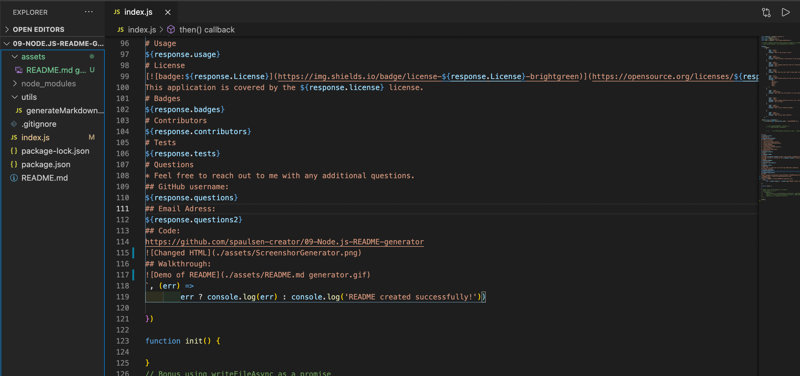

# Title
Node.JS README generator
# License

This application is covered by the MIT license. 
# Description
This is a node based peice of code that allows a user to create a quick, professional README for a given project.  Simple additions can be added to this code to allow for more indepth content for a project.   
## Table of Contents 
1. [Title](#Title)
2. [Descrition](#Description)
3. [Installation](#Installation)
4. [Usage](#Usage)
5. [License](#License)
6. [Contributors](#Contributors)
7. [Test](#Tests)
8. [Questions](#Questions)  
# Installation
npm i   
# Usage
A simple knowledge of node.js use running from the file in a terminal will allow a content creaotr to generate a readme.     
# Contributors
There were no direct contributors to this project.  
# Tests
npm run tests  
# Questions
* Feel free to reach out to me with any additional questions.
## GitHub username: 
spaulsen-creator 
## Email Adress:
spaulsen68@yahoo.com
## Code:
https://github.com/spaulsen-creator/09-Node.js-README-generator

## Walkthrough:

